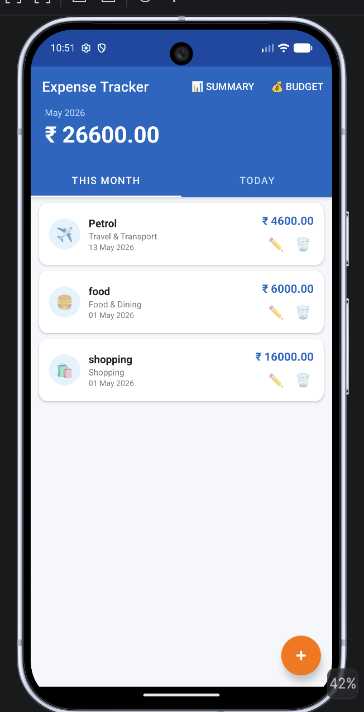
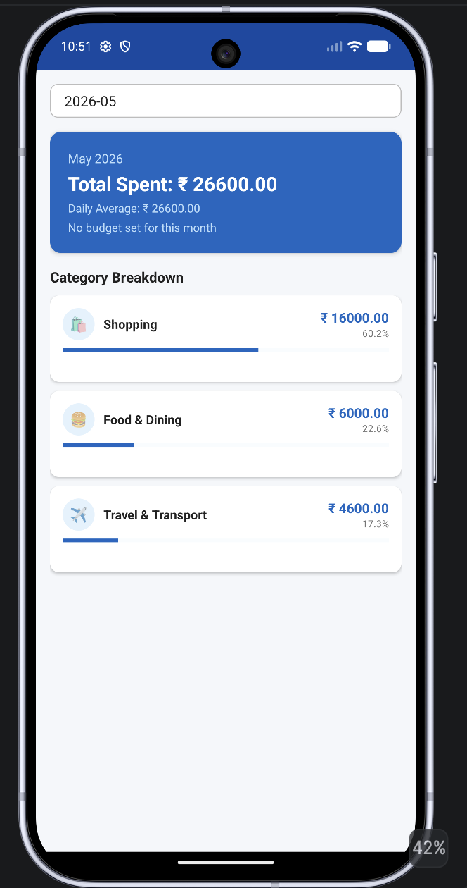
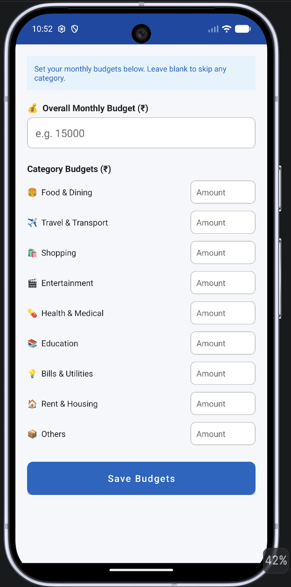

# Expense Tracker — Android Application

Android-based expense tracking and budgeting application built using Java and SQLite for offline personal finance management.

The application enables users to:
- Track daily expenses
- Manage category-wise budgets
- Monitor monthly spending
- Analyze expense summaries
- Maintain fully offline financial records

---

# Features

- Add, edit, and delete expenses
- Category-based expense organization
- Monthly and daily spending summaries
- Budget management with usage tracking
- Offline SQLite database storage
- Category-wise analytics and breakdown
- Progress indicators for budget monitoring
- Clean Material Design-inspired UI
- Lightweight and fully offline architecture

---

# Screenshots

## Home Screen






---

# Tech Stack

## Mobile Development
- Java
- Android SDK
- Android Studio

## Database
- SQLite
- SQLiteOpenHelper

## UI Components
- RecyclerView
- CardView
- Material Components

---

# Project Structure

```bash
app/src/main/
├── java/com/example/expensetracker/
│   ├── activities/
│   │   ├── MainActivity.java
│   │   ├── AddEditExpenseActivity.java
│   │   ├── SummaryActivity.java
│   │   └── BudgetActivity.java
│   │
│   ├── adapters/
│   │   └── ExpenseAdapter.java
│   │
│   ├── database/
│   │   └── DatabaseHelper.java
│   │
│   ├── models/
│   │   ├── Expense.java
│   │   └── Budget.java
│   │
│   └── utils/
│       └── Constants.java
│
├── res/
│   ├── layout/
│   ├── drawable/
│   ├── menu/
│   └── values/
│
└── AndroidManifest.xml
```

---

# Core Functionalities

## Expense Management
- Create and manage expense entries
- Store amount, category, date, and notes
- Edit or remove transactions dynamically

## Budget Tracking
- Configure overall monthly budgets
- Set category-specific limits
- Monitor usage through progress indicators

## Analytics & Summary
- Monthly expense summaries
- Category-wise spending breakdown
- Daily expense tracking

---

# Database Schema

## Table: `expenses`

| Column | Type | Description |
|---|---|---|
| id | INTEGER | Primary key |
| title | TEXT | Expense title |
| amount | REAL | Expense amount |
| category | TEXT | Expense category |
| date | TEXT | Transaction date |
| note | TEXT | Optional note |

---

## Table: `budgets`

| Column | Type | Description |
|---|---|---|
| id | INTEGER | Primary key |
| category | TEXT | Budget category |
| amount | REAL | Budget limit |
| month | TEXT | Budget month |

---

# Installation

## Clone Repository

```bash
git clone https://github.com/your-username/expense-tracker-android.git
cd expense-tracker-android
```

---

# Open in Android Studio

1. Open Android Studio
2. Select:
   ```text
   Open an Existing Project
   ```
3. Choose the project folder
4. Wait for Gradle sync
5. Run on emulator or physical device

---

# Dependencies

```gradle
implementation 'androidx.appcompat:appcompat:1.6.1'
implementation 'com.google.android.material:material:1.11.0'
implementation 'androidx.recyclerview:recyclerview:1.3.2'
implementation 'androidx.cardview:cardview:1.0.0'
```

---

# Design Decisions

- SQLite used for lightweight offline persistence
- RecyclerView for efficient expense rendering
- Modular activity-based architecture
- Material UI components for cleaner user experience
- Offline-first approach with no internet dependency

---

# Future Improvements

- Expense charts and visualization
- Export reports as PDF/CSV
- Cloud synchronization
- Authentication system
- Dark mode support
- Multi-device backup integration

---

# License

This project is licensed under the MIT License.